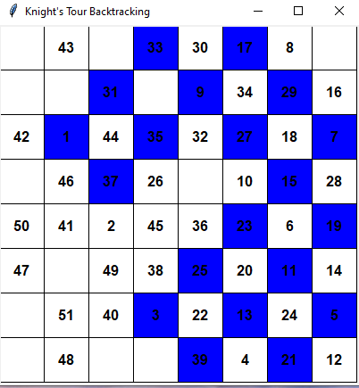
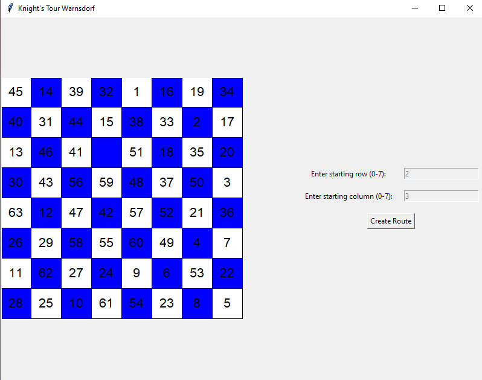

# Knight's Tour Problem

This repository contains Python implementations of the Knight's Tour problem, along with explanations and resources for further learning.

## Introduction

The Knight's Tour is a classic problem in the field of chess puzzles. The task is to find a sequence of moves for a knight on a chessboard such that the knight visits every square exactly once.

## Algorithms Implemented

### Backtracking Algorithm

The backtracking algorithm is a brute-force approach that systematically explores all possible moves of the knight until a solution is found. It employs recursion to try different moves and backtracks when it reaches a dead-end.

- **File:** [main.py](https://github.com/Beltag-Paula/The-Knight-Tour-Problem/blob/main/The%20Knight%20Problem/main.py)
- **Description:** This file contains the implementation of the Knight's Tour problem using the backtracking algorithm.
- **Functionality:** It initializes the chessboard, implements the backtracking algorithm to find the knight's tour, and prints the resulting tour on the console.
- **Visualization:** The file [visualizeRoute.py]((https://github.com/Beltag-Paula/The-Knight-Tour-Problem/blob/main/The%20Knight%20Problem/visualizeRoute.py)) provides a graphical representation of the backtracking algorithm's execution, allowing users to visually track the knight's movements.

### Warnsdorff's Algorithm

Warnsdorff's algorithm is an improvement over the backtracking approach, utilizing a heuristic to prioritize moves that lead to squares with fewer available moves. This heuristic helps in reducing the search space and finding solutions more efficiently.

- **File:** [main2Warnsdorff.py](https://github.com/Beltag-Paula/The-Knight-Tour-Problem/blob/main/The%20Knight%20Problem/main2Warnsdorff.py)
- **Description:** This file contains the implementation of the Knight's Tour problem using Warnsdorff's algorithm.
- **Functionality:** It initializes the chessboard, implements Warnsdorff's algorithm to find the knight's tour, and prints the resulting tour on the console.
- **Visualization:** The file [visualizeRoute2.py](https://github.com/Beltag-Paula/The-Knight-Tour-Problem/blob/main/The%20Knight%20Problem/visualizeRoute2.py) provides a graphical representation of Warnsdorff's algorithm, enabling users to visualize the heuristic-based movement of the knight.

## File Descriptions

1. `main.py`: Implementation of the Knight's Tour problem using the backtracking algorithm.
2. `visualizeRoute.py`: Visual representation of the backtracking algorithm's execution.
3. `main2Warnsdorff.py`: Implementation of the Knight's Tour problem using Warnsdorff's algorithm.
4. `visualizeRoute2.py`: Visual representation of Warnsdorff's algorithm.

## Detailed Explanations

### main.py

This file contains the implementation of the Knight's Tour problem using the backtracking algorithm. It initializes the chessboard, recursively explores all possible moves of the knight, and backtracks when necessary.

### visualizeRoute.py

This file provides a graphical representation of the backtracking algorithm's execution. It visualizes the knight's movements on a chessboard, allowing users to observe how the algorithm explores different paths to find a solution.

### main2Warnsdorff.py

This file implements the Knight's Tour problem using Warnsdorff's algorithm, an improvement over the backtracking approach. It prioritizes moves that lead to squares with fewer available moves, effectively reducing the search space.

### visualizeRoute2.py

Similar to `visualizeRoute.py`, this file offers a graphical representation of Warnsdorff's algorithm. It demonstrates how the heuristic-based movement of the knight leads to efficient solutions.

## Resources

- [Wikipedia - Knight's Tour](https://en.wikipedia.org/wiki/Knight%27s_tour)
- [GeeksforGeeks - Knight's Tour Problem](https://www.geeksforgeeks.org/the-knights-tour-problem/)
- [GeeksforGeeks - Warnsdorff's Algorithm](https://www.geeksforgeeks.org/warnsdorffs-algorithm-knights-tour-problem/)

